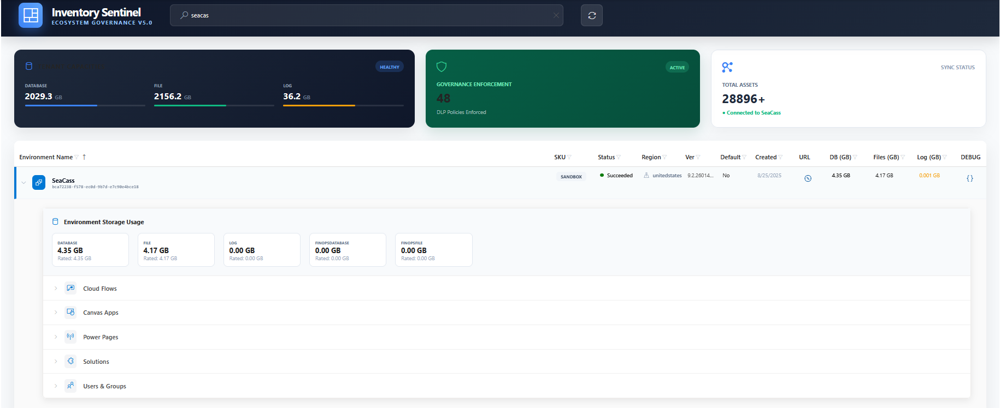

# 🛡️ Power Platform Governance Sentinel

A comprehensive, high-performance monitoring and inventory dashboard for Microsoft Power Platform.

## ✨ Features
*   **Omni-Sync Engine**: Consolidates data from BAP, Power Automate, and Dataverse APIs.
*   **Interactive Dashboard**: Real-time view of environments, storage consumption, and asset health.
*   **ALM Visiblity**: Tracks managed vs unmanaged solutions across the entire tenant.
*   **Scale Ready**: Optimized for large tenants with 100+ environments.

## 📁 Key Components
*   **[GovSolutionsInventory](./GovSolutionsInventory)**: PCF Dashboard UI.
*   **[InventoryPuller](./InventoryPuller)**: High-speed sync logic (C#).
*   **[Solutions](./Solutions)**: Ready-to-import Dataverse solutions.
*   **[InventorySyncFunction](./InventorySyncFunction)**: Azure-native background worker.

## 🚀 Getting Started
Please refer to the **[Adoption & Deployment Guide](./ADOPTION_GUIDE.md)** for full setup instructions, authentication requirements, and architecture details.

## 📊 Documentation
*   **[Dataverse Schema Map](./Docs/DataverseSchemaDocumentation.html)**: Visual guide to the underlying data model.

---
&copy; 2026 Governance Bridge Initiative
